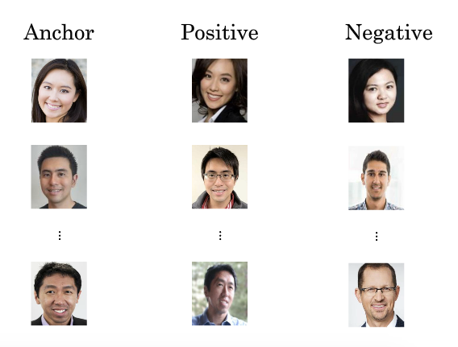

### 第四周：特殊应用：人脸识别和神经风格转换（Special applications: Face recognition &Neural style transfer）

#### 什么是人脸识别？（What is face recognition?）
人脸验证（Face Verification）和人脸识别（Face Recognition）的区别：

- 人脸验证：一般指一个一对一问题，只需要验证输入的人脸图像是否与某个已知的身份信息对应；
- 人脸识别：一个更为复杂的一对多问题，需要验证输入的人脸图像是否与多个已知身份信息中的某一个匹配。
  
一般来说，由于需要匹配的身份信息更多导致错误率增加，人脸识别比人脸验证更难一些。

#### One-Shot学习（One-shot learning）
人脸识别所面临的一个挑战是要求系统只采集某人的一个面部样本，就能快速准确地识别出这个人，即只用一个训练样本来获得准确的预测结果。这被称为One-Shot 学习。

有一种方法是假设数据库中存有 N 个人的身份信息，对于每张输入图像，用 Softmax 输出 N+1 种标签，分别对应每个人以及都不是。然而这种方法的实际效果很差，因为过小的训练集不足以训练出一个稳健的神经网络；并且如果有新的身份信息入库，需要重新训练神经网络，不够灵活

因此，我们通过学习一个 Similarity 函数来实现 One-Shot 学习过程。Similarity 函数定义了输入的两幅图像的差异度，其公式如下：

$$Similarity  = d(img1, img2)$$

可以设置一个超参数$τ$作为阈值，作为判断两幅图片是否为同一个人的依据。

#### Siamese 网络（Siamese network）
实现 Similarity 函数的一种方式是使用Siamese 网络，它是一种对两个不同输入运行相同的卷积网络，然后对它们的结果进行比较的神经网络。

如上图示例，将图片 $x^{(1)}$、$x^{(2)}$ 分别输入两个相同的卷积网络中，经过全连接层后不再进行 Softmax，而是得到特征向量 $f(x^{(1)})$、$f(x^{(2)})$。这时，Similarity 函数就被定义为两个特征向量之差的 L2 范数：

$$d(x^{(1)}, x^{(2)}) = ||f(x^{(1)}) - f(x^{(2)})||^2_2$$

#### Triplet 损失
Triplet 损失函数用于训练出合适的参数，以获得高质量的人脸图像编码。“Triplet”一词来源于训练这个神经网络需要大量包含 Anchor（靶目标）、Positive（正例）、Negative（反例）的图片组，其中 Anchor 和 Positive 需要是同一个人的人脸图像。

对于这三张图片，应该有：

$$||f(A) - f(P)||^2_2 + \alpha \le ||f(A) - f(N)||^2_2$$

其中，$\alpha$被称为间隔（margin），用于确保 $f()$ 不会总是输出零向量（或者一个恒定的值）。

Triplet 损失函数的定义：

$$L(A, P, N) = max(||f(A) - f(P)||^2_2 - ||f(A) - f(N)||^2_2 + \alpha, 0)$$

其中，因为 $||f(A) - f(P)||^2_2 - ||f(A) - f(N)||^2_2 + \alpha$的值需要小于等于 0，因此取它和 0 的更大值。

对于大小为 m 的训练集，代价函数为：

$$J = \sum^m_{i=1}L(A^{(i)}, P^{(i)}, N^{(i)})$$

通过梯度下降最小化代价函数。

在选择训练样本时，随机选择容易使 Anchor 和 Positive 极为接近，而 Anchor 和 Negative 相差较大，以致训练出来的模型容易抓不到关键的区别。因此，最好的做法是人为增加 Anchor 和 Positive 的区别，缩小 Anchor 和 Negative 的区别，促使模型去学习不同人脸之间的关键差异。

